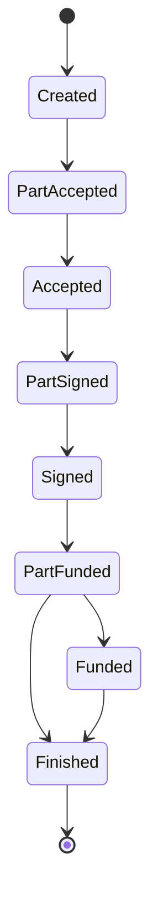

# Protocolo PLS

## Visão Geral

O Protocolo da Private Law Society (PLS) é um sistema de contratos privados que opera sem participação do Estado, utilizando Bitcoin como colateral e arbitragem privada para resolução de disputas.

## Componentes Principais

### 1. Contrato Documento
- Arquivo legível por humanos (txt, doc, pdf)
- Não deve conter informações pessoais reais
- Define os termos e condições do acordo

### 2. Contrato JSON
- Versão legível por máquina do contrato
- Segue especificação PLIP-01
- Contém metadados, chaves públicas e assinaturas

### 3. Colateral Bitcoin
- Depositado em carteira multisig
- Garante cumprimento das obrigações
- Liberado por consenso das partes + árbitros

## Estados do Contrato



### Descrição dos Estados

- **Created**: Contrato criado, aguardando aceitação
- **PartAccepted**: Parcialmente aceito pelas partes
- **Accepted**: Aceito por todas as partes
- **PartSigned**: Parcialmente assinado
- **Signed**: Assinado por todas as partes
- **PartFunded**: Parcialmente financiado
- **Funded**: Colateral depositado
- **Finished**: Contrato concluído

## Estrutura do Contrato JSON

```json
{
    "version": 1,
    "state": "Signed",
    "createdAt": 1640995200,
    "document": {
        "fileHash": "sha256_hash_do_documento",
        "pubkeys": {
            "clients": ["chave_publica_1", "chave_publica_2"],
            "arbitrators": ["chave_arbitro_1", "chave_arbitro_2"]
        }
    },
    "collateral": {
        "network": "bitcoin",
        "pubkeys": {
            "clients": ["chave_multisig_1", "chave_multisig_2"],
            "arbitrators": ["chave_arbitro_1", "chave_arbitro_2"]
        },
        "arbitratorsQuorum": 2,
        "multisigAddress": "endereco_multisig"
    },
    "signatures": {
        "chave_publica_1": "assinatura_1",
        "chave_publica_2": "assinatura_2"
    }
}
```

## Quorum Recomendado

### Para Contratos de Baixo Valor
- **1 árbitro**: Multisig 1-de-2 (1 parte + 1 árbitro)

### Para Contratos de Médio Valor
- **3 árbitros**: Multisig 2-de-4 (1 parte + 2-de-3 árbitros)

### Para Contratos de Alto Valor
- **5 árbitros**: Multisig 3-de-6 (1 parte + 3-de-5 árbitros)

## Boas Práticas

### 1. Privacidade
- Nunca incluir dados pessoais reais
- Usar pseudônimos ou identificadores
- Manter anonimato das partes

### 2. Segurança
- Usar carteiras HD (Hierarchical Deterministic)
- Assinaturas Schnorr para secp256k1
- Endereços Taproot para multisig

### 3. Comunicação
- Usar Nostr para comunicação (opcional)
- Manter registro de todas as comunicações
- Seguir protocolo PLIP-02

## Integração com WoT e BJP

### Web of Trust (WoT)
- Sistema de reputação baseado em avaliações
- Reduz colateral necessário para contratos
- Melhora confiança entre as partes

### Bitcoin Justice Protocol (BJP)
- Implementação prática do protocolo PLS
- Interface para criação e gerenciamento de contratos
- Integração com carteiras Bitcoin

## Referências

- [PLIP-01](https://github.com/PrivateLawSociety/pls-protocol/blob/main/plips/01.md) - Especificação do protocolo de contratos
- [PLIP-02](https://github.com/PrivateLawSociety/pls-protocol/blob/main/plips/02.md) - Especificação do protocolo de comunicação
- [PLS-BJP](https://github.com/PrivateLawSociety/pls-bjp) - Implementação do protocolo
- [PLS-WoT](https://github.com/PrivateLawSociety/pls-wot) - Sistema de reputação
